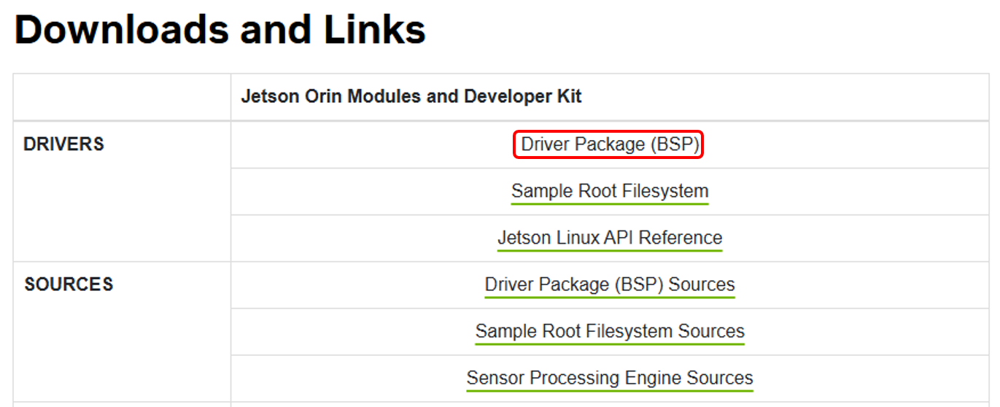

# SerBot II Recovery (for Jetson Orin JP 6.0)
SerBot II 에 설치되어 있는 OS 는 Nvidia 의 Jetpack 기반으로 실습에 필요한 필수 소프트웨어 및 로봇 구동을 위한 소프트웨어가 설치되어 있습니다. 설치된 OS가 부팅 되지 않거나, 공장 초기화를 진행해야 하는 경우에 다음 절차를 진행하면 초기 상태의 SerBot II를 활용할 수 있습니다. 

## 주의 사항 
- 아래의 복구 절차는 보드가 부팅되지 않는 상황에서 진행하는것을 권장합니다. 
- 여기서 설명하는 복구는 Ubuntu 가 설치된 PC 또는 랩탑이 필수적이며, WSL 이나 가상머신을 이용하는 환경에 대해서는 지원하지 않습니다. 
- 복구 과정을 진행하면 이전 작업 내용은 완전하게 삭제됩니다. 필요한 내용은 미리 백업 이후 진행하시기 바랍니다. 

## 준비물  
- Host PC : Ubuntu 20.04 or Ubuntu 22.04
- USB-Type C Cable
- Jupmer Cable 

## 복구 절차 
### 1. 하드웨어 연결 
Jumper Cable 을 Jetson 보드의 후면 하단에 연결합니다. Jetson 보드를 장비에서 별도로 분리하지 않아도 됩니다.(다음 그림 참조)

Jumper 연결 후 USB-C 케이블을 PC와 Jetson 보드에 연결합니다. 
- PC (USB-A) <-> Jetson (USB-C or USB-Micro)

이후 장비의 전원을 켭니다. Jetson 보드가 복구 모드로 진입되었는지 여부는 Host PC의 터미널에서 "lsusb" 를 통해 확인이 가능합니다. 

이와 같이 연결한 경우에 위와 같이 장치 목록이 확인되지 않는 경우 USB 케이블 변경이나 포트 변경을 시도해보시기 바랍니다. 

포트 변경등에도 정상적인 인지가 되지 않는 경우에는 자사로 별도 연락 부탁드립니다. 

### 2. 필수 라이브러리 설치 및 BSP 다운로드 
Ubuntu PC에 복구를 위한 필수 패키지를 설치합니다. 네트워크 연결은 필수적이며 처음 1회 설치 이후 추가 설치는 필요하지 않습니다. 
- sudo apt install qemu-user-static sshpass abootimg nfs-kernel-server libxml2-utils binutils -y

이후 Nvidia사의 Jetson Linux 페이지에서 BSP를 다운로드 받습니다. 

- [Jetpack 6.0 Link](https://developer.nvidia.com/embedded/jetson-linux-r363)

복구에 필요한 파일시스템은 자사로 연락 주시면 다운로드 링크를 제공해 드립니다. 

### 3. 복구 환경 구성 및 복구 
SerBot의 루트파일 시스템은 아래 링크에서 다운로드 받거나, 다운로드가 되지 않는 경우 자사에 별도연락 바랍니다. 
- [SerBot II rootfs Link](http://hanback-nas.synology.me:5000/sharing/sEbjNOmFm)

다음 명령에 따라 Jetson 에 설치할 BSP 를 설치합니다. 
   
- tar xf Jetson_Linux_R36.3.0_aarch64
- sudo tar xvfj serbot-rootfs.tar.bz2 -C Linux_for_Tegra/rootfs/
- cd Linux_for_Tegra/
- sudo ./apply_binaries.sh
- sudo ./tools/l4t_flash_prerequisites.sh
- sudo tools/l4t_create_default_user.sh -u soda -p soda -a -n soda --accept-license
- sudo ./tools/kernel_flash/l4t_initrd_flash.sh --external-device nvme0n1p1 \
  -c tools/kernel_flash/flash_l4t_external.xml -p "-c bootloader/t186ref/cfg/flash_t234_qspi.xml" \
  --showlogs --network usb0 p3509-a02+p3767-0000 internal
