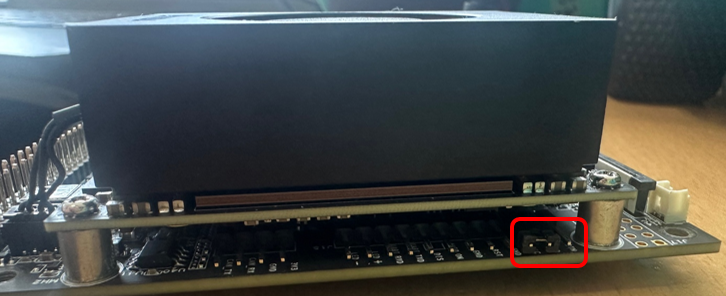
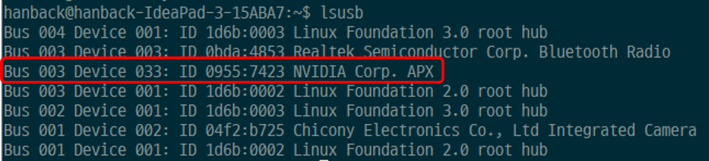

# SerBot II 복구 가이드 (Jetson Orin NX, JetPack 6.0 기준)
이 문서는 SerBot II 를 출고 상태로 복원하는 절차를 안내합니다.
SerBot II 는 NVIDIA JetPack 기반의 운영체제를 사용하며, 실습 및 로봇 구동에 필요한 필수 소프트웨어가 사전 설치되어 있습니다.
운영체제가 부팅되지 않거나 공장 초기화가 필요한 경우, 본 가이드를 따라 복구 작업을 진행하면 SerBot II 를 초기 상태로 되돌릴 수 있습니다.

## 주의 사항 
- 아래 복구 절차는 운영체제가 정상 부팅되지 않을 때 실행하는 것을 권장합니다.
- 복구 작업은 Ubuntu 20.04 또는 22.04가 설치된 PC 또는 노트북에서만 지원됩니다.
  - ※ 가상머신 또는 WSL(Windows Subsystem for Linux)에서는 동작을 보장하지 않습니다.
- 복구 과정에서 SerBot II에 저장된 모든 데이터는 완전히 삭제됩니다.
  - 반드시 필요한 데이터는 사전에 백업해 주세요.

## 준비물  
- Host PC : Ubuntu 20.04 or Ubuntu 22.04
- USB-Type C Cable
- [PCB Jumper link](https://www.devicemart.co.kr/goods/view?no=12072839)

## 복구 절차 (JetPack 6.0 기준)

### 1단계: Jetson 보드를 복구 모드로 진입

#### 1-1. 복구 모드 설정
1. SerBot II 의 전원을 끕니다.
2. Jetson 보드의 하단 후면부에 PCB Jumper Link를 연결합니다.


#### 1-2. USB 케이블 연결
- Host PC (USB-A) <--> Jetson 보드 (USB-C 또는 USB-Micro)

#### 1-3. 전원 ON 및 복구 모드 확인
1. SerBot II 의 전원을 켭니다.
2. Host PC 터미널에서 다음 명령어를 입력해 복구 모드 진입 여부를 확인합니다. 
```sh
lsusb
```
3. 다음과 같은 출력이 확인되면 Jetson 보드가 복구 모드로 진입한 것입니다.
```out
Bus 001 Device 005: ID 0955:7323 NVIDIA Corp. APX
```

출력되는 ID 에 따른 Orin NX 의 버전 구분은 다음과 같습니다. 
| USB ID  | Orin NX 버전 |
|:-:|:-:|
| 0955:7323 Nvidia Corp. | Jetson Orin NX 16GB |
| 0955:7423 Nvidia Corp. | Jetson Orin NX 8GB |

>***각 Orin NX 종류에 따라 복구에 사용되는 이미지가 다르기 때문에 반드시 정확한 버전 정보를 확인하여 "2-1. 복구 이미지 다운로드" 에 있는 링크를 통해 복구 이미지를 다운로드 받으시기 바랍니다.***

아래 그림은 Orin NX 8GB 인 경우 입니다. 


> 만약 NVIDIA Corp. APX 장치가 표시되지 않는다면:
>> USB 케이블을 교체하거나  
>> 다른 USB 포트에 연결한 후  
>> 1-1. 복구 모드 설정부터 다시 시도하세요.  

### 2단계: 복구 환경 구성
Host PC에 한백전자에서 제공하는 Orin NX 전용 복구 이미지를 다운로드하고 압축을 해제합니다. 이 과정을 통해 작업 디렉터리가 생성됩니다.

#### 2-1. 복구 이미지 다운로드
> Orin NX 16GB 복구 이미지 다운로드 
>- [Jetpack 6.0 Orin NX 16GB 복구 이미지 다운로드 링크](http://hanback-nas.synology.me:5000/sharing/NBluLH8UE)
>   - 파일명: mfi_recomputer-orin-nx-16g.tar.gz
>       - NAS 페이지가 열리면 [다운로드] 버튼 클릭
>       - 다운로드에 문제가 있는 경우 담당자(기술영업)에게 문의하세요. 
>   - 저장 위치: 홈 디렉터리(~/)

> Orin NX 8GB 복구 이미지 다운로드 
>- [Jetpack 6.0 Orin NX 8GB 복구 이미지 다운로드 링크](http://hanback-nas.synology.me:5000/sharing/MT6pRQ0wp)
>   - 파일명: mfi_recomputer-orin-nx-8g.tar.gz
>       - NAS 페이지가 열리면 [다운로드] 버튼 클릭
>       - 다운로드에 문제가 있는 경우 담당자(기술영업)에게 문의하세요. 
>   - 저장 위치: 홈 디렉터리(~/)

#### 2-2. 작업 디렉터리 구성 및 압축 해제
> Orin NX 16GB 인 경우 
```sh
cd ~
tar xvfz mfi_recomputer-orin-nx-16g.tar.gz
```
***
> Orin NX 8GB 인 경우 
```sh
cd ~
tar xvfz mfi_recomputer-orin-nx-8g.tar.gz
```

#### 2-3. 복구 도구 설치 및 초기화
```sh
sudp apt update
sudo apt install qemu-user-static sshpass abootimg nfs-kernel-server libxml2-utils binutils -y
```

### 3단계: SerBot II 이미지 플래싱 
Jetson 보드가 복구 모드로 진입한 상태에서, mfi_recomputer-orin-j401 디렉터리로 이동해 다음 명령어를 실행합니다.

```sh
cd ~/mfi_recomputer-orin-j401/
sudo ./tools/kernel_flash/l4t_initrd_flash.sh --flash-only --massflash 1 --network usb0  --showlogs
```
> 해당 명령은 SerBot II 에 탑재된 Jetson Orin NX 8GB, 16GB 기준으로 작성되었으며, Jetson Xavier NX 등 보드 모델이 다를 경우 기종에 맞는 복구 가이드를 참조하시기 바랍니다.

## 마무리
플래싱이 완료되면 SerBot II 는 출고 상태의 JetPack 6.0 + 한백전자 SerBot II RootFS 환경으로 복원됩니다. 이후 전원을 재부팅하고 GUI 또는 SSH를 통해 시스템에 접속할 수 있습니다.
